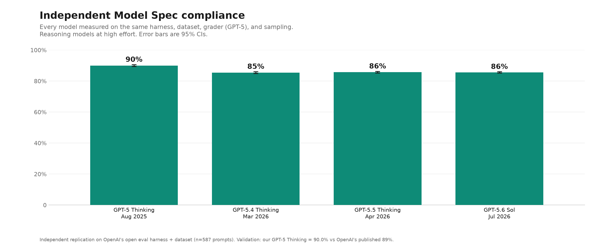
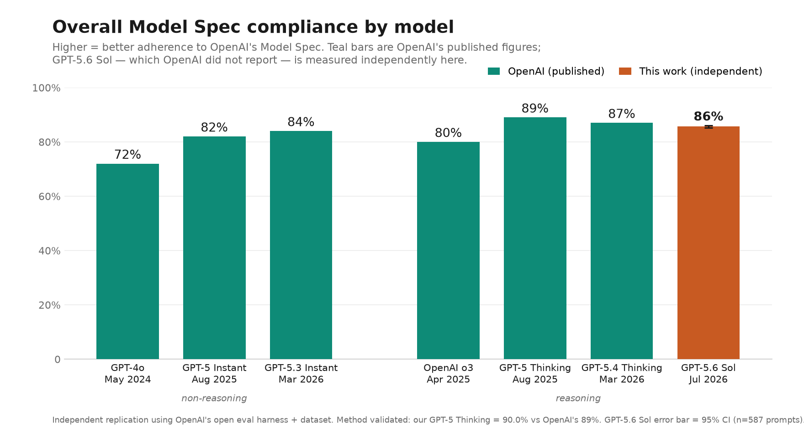

# Results

An independent replication of OpenAI's Model Spec compliance eval, extended to the recent
reasoning flagships OpenAI has **not** reported scores for. Method, settings, and validation
are in [methodology.md](methodology.md); everything here is reproducible (see §8).

## 1. Headline

Measured on OpenAI's own eval harness and 587-prompt dataset, with a single consistent
methodology (GPT-5 grader, 5 candidate samples × 5 gradings, high reasoning effort):

- **GPT-5 Thinking (Aug 2025): 90.0%** — reproduces OpenAI's published 89%.
- **GPT-5.4 Thinking (Mar 2026): 85.5%**
- **GPT-5.5 Thinking (Apr 2026): 85.7%** — first public measurement.
- **GPT-5.6 Sol (Jul 2026): 85.6%** — first public measurement.

Compliance **peaked at GPT-5 Thinking and dropped ~4.5 points to a plateau** across the three
following flagships. GPT-5.5 and GPT-5.6 Sol — the two models OpenAI has not reported — are each
significantly below GPT-5 Thinking, and statistically indistinguishable from one another.



## 2. Main result

| Model | Overall compliance | 95% CI | OpenAI published |
|---|---|---|---|
| GPT-5 Thinking | 90.0% | ±0.6 | 89% |
| GPT-5.4 Thinking | 85.5% | ±0.6 | 87% |
| GPT-5.5 Thinking | 85.7% | ±0.5 | *unreported* |
| GPT-5.6 Sol | 85.6% | ±0.4 | *unreported* |

All at `reasoning_effort=high`; GPT-5 grader; 587 prompts; error bars are fixed-benchmark 95% CIs
(sampling noise). Machine-readable in [results/summary.csv](results/summary.csv).

**Paired significance** (same prompts → paired test controls for prompt difficulty; the correct,
most powerful test — see `src/compare.py`):

| Comparison | Gap | p |
|---|---|---|
| GPT-5 Thinking − GPT-5.4 | 4.5 pts | < 0.0001 |
| GPT-5 Thinking − GPT-5.5 | 4.3 pts | 0.0001 |
| GPT-5 Thinking − GPT-5.6 Sol | 4.3 pts | 0.0001 |
| GPT-5.5 − GPT-5.6 Sol | 0.09 pts | 0.92 (identical) |

## 3. Validation — read this before trusting the absolute numbers

We anchored the harness against the two models OpenAI *did* report:

| Model | Ours | OpenAI published | Difference |
|---|---|---|---|
| GPT-5 Thinking | 90.0% | 89% | +1.0 |
| GPT-5.4 Thinking | 85.5% | 87% | −1.5 |

The two anchors miss in **opposite directions** (+1, −1.5), so this is **reproduction scatter of
~±1.5 points, not a systematic bias**. We characterize the harness as reproducing OpenAI's published
figures *to within ~1.5 points*, not exactly. The **direction and significance** of the GPT-5.5 /
Sol regression do not depend on this, because those are internal, same-methodology, paired
comparisons against GPT-5 Thinking (which we reproduce well).

We ran two diagnostics on the −1.5 GPT-5.4 gap:

- **Version drift — ruled out.** There is only one GPT-5.4 checkpoint (`gpt-5.4-2026-03-05`, early
  March 2026); the `gpt-5.4` alias points to it. There is no newer checkpoint for the alias to have
  drifted to, so we and OpenAI scored the same-era model.
- **Reasoning effort — ruled out as the cause of the shortfall, but found to matter a lot.** GPT-5.4
  at *no* reasoning scores **82.6%** vs **85.5%** at high — so *more* reasoning yields *more*
  compliance, and we already use the maximum (`high`). The 85.5→87 gap cannot be closed by tuning
  effort. The likely residual causes are minor grader/spec-snapshot/config differences between
  OpenAI's March-2026 internal run and the current open harness, plus sampling.

**Bonus finding:** Model Spec compliance is strongly reasoning-effort-dependent (~3 points for
GPT-5.4). We ran every target model at `high` — the *charitable*, best-case setting — and even so,
GPT-5.5 and Sol land ~4.5 points below GPT-5 Thinking.

## 4. Where GPT-5.6 Sol loses ground (vs GPT-5 Thinking)

By top-level spec section (drop = GPT-5 Thinking − Sol):

| Section | GPT-5 Thinking | Sol | Drop |
|---|---|---|---|
| chain_of_command | 93.1% | 86.9% | −6.2 |
| seek_truth | 91.5% | 85.2% | −6.2 |
| best_work | 86.9% | 81.8% | −5.1 |
| stay_in_bounds | 87.2% | 83.8% | −3.4 |
| style | 91.3% | 89.4% | −1.9 |

The regression is concentrated in **instruction-following and honesty**, not raw safety; style is
barely affected. Largest sub-section drops (with prompt counts — small-n rows are suggestive only):

| Sub-section | Drop | n |
|---|---|---|
| ask_clarifying_questions | −19.0 | 20 |
| support_programmatic_use | −12.5 | 24 |
| be_thorough_but_efficient | −10.7 | 28 |
| express_uncertainty | −10.0 | 36 |
| assume_best_intentions | −19.2 | 12 |
| transformation_exception | −32.2 | 9 (noisy) |

Regenerate with `src/drilldown.py` (needs the Drive logs). Note: some prompts in this set are
deliberately adversarial content from OpenAI's public dataset; we describe failures at altitude
rather than reproduce sensitive prompt/response text here.

## 5. Is the regression "more cautious"? No.

Direction of every clear disagreement, classified as OVER-cautious (over-refused), UNDER-cautious
(over-acted / didn't ask / over-produced), or OTHER (accuracy/format/honesty). See
`src/failure_direction.py` and [results/failure_directions.json](results/failure_directions.json)
(prompt IDs + labels, auditable against the public dataset).

Paired structure (n=587): both pass 490 · both fail 30 · **Sol-only fails 46** · GPT-5-Thinking-only
fails 21 (net −25 ≈ the 4.3-pt gap). Of Sol's 46 losses:

- **UNDER-cautious: 23** (50%) — proceeded / over-answered when it should have refused, asked, or
  withheld.
- **OVER-cautious: 15** (33%) — reflexive refusals (e.g., a canned "flagged for possible
  cybersecurity risk" deflection on legitimate journalist queries).
- **OTHER: 8** (17%) — accuracy / thoroughness / honesty.

So Sol's regression is **not primarily over-caution** — if anything it tilts toward *less* caution.
It is making both kinds of errors, leaning permissive.

## 6. In the context of OpenAI's published lineup



OpenAI's published bars plus our independently measured GPT-5.6 Sol. (Uses OpenAI's published values
for their reported models; our GPT-5.6 Sol is the new measurement. Our GPT-5 Thinking reproduction
of 90.0% vs their 89% is the validation.)

## 7. Caveats

- Text-only; no multimodal or tool/agentic scenarios.
- The grader is itself an LLM (GPT-5) — a known judge-bias vector; median-of-5 mitigates variance,
  not systematic bias.
- Absolute scores reproduce OpenAI's published figures to ~±1.5 pts, not exactly (§3). Lead with the
  internal, paired comparisons.
- The over/under-caution labels (§5) are gpt-4o-mini classifications; the per-prompt labels are
  published for audit.
- Sub-section rows with small n are suggestive, not conclusive.

## 8. Reproduce it

Full rerun (regenerates everything from OpenAI's public dataset):

```bash
./setup.sh
export OPENAI_API_KEY=...
python src/run_eval.py --model openai/gpt-5.6-sol --preset moderate \
    --epochs 5 --grader-samples 5 --reasoning-effort high --log-dir runs/sol
python src/analyze.py runs/sol/*.eval --pool
```

Re-run our *analyses* on our *exact* outputs without re-spending: download the raw `.eval` logs from
the Google Drive folder (linked in the README) into `runs/`, then:

```bash
python src/compare.py --a runs/anchor-gpt5-thinking runs/anchor-topup --b runs/sol runs/sol-topup \
    --labels "GPT-5 Thinking" "GPT-5.6 Sol"
python src/drilldown.py
python src/failure_direction.py
python src/make_chart.py --ours-only
```

Exact model ids, settings, and the validation reasoning are in [methodology.md](methodology.md).

## 9. Compute

~$4,900 of OpenAI API credits (grader dominates), funded by a BlueDot Rapid AI Safety Grant. Full
per-run token counts are in the raw logs.
